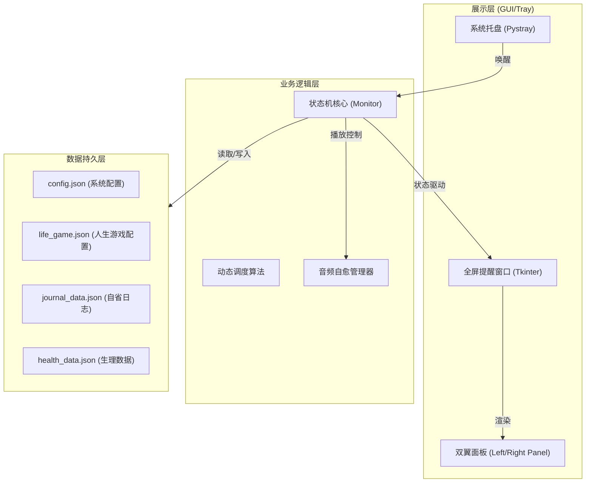
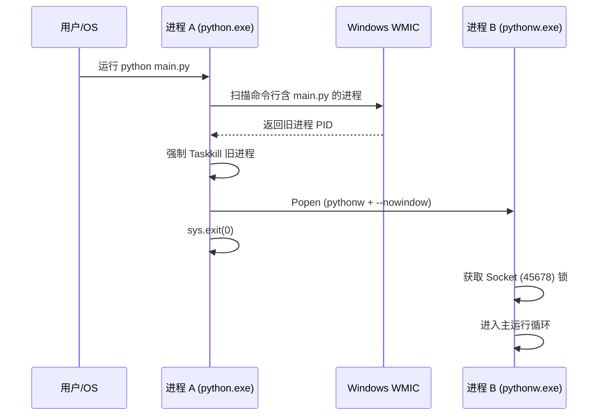

# Work Health 架构设计文档 (ARCHITECTURE.md)

## 1. 概述 (Overview)

| 维度 | 详细内容 |
| :--- | :--- |
| **项目名称** | Work Health (久坐健康助手) |
| **核心技术栈** | Python 3.10, Tkinter, Pygame (Audio), Pystray (Tray), JSON |
| **运行环境** | conda env `work_health`（隔离依赖，避免多 Python 共存的 user site 污染） |
| **核心价值** | 🛡️ 保护开发者生理健康，通过“人生游戏”框架实现长期生产力与心理自省的平衡。 |
| **最后更新** | 2026-06-22 |

### 核心功能点
*   🎮 **人生游戏引擎**: 基于 Dan Koe 哲学，通过 `life_game.json` 配置 6 大核心组件（愿景/反愿景等）。
*   ⏳ **动态番茄钟**: 智能识别时段（如晨间冲刺），自动切换工作/休息时长策略。
*   🧠 **深度自省系统**: 提供分阶段（早/中/晚）的心理建设提问，支持 Markdown 格式日志持久化。
*   📊 **健康指标追踪**: 每日强制/手动录入体重、血压等核心指标并存档。

---

## 2. 系统架构设计 (System Architecture)



> **架构说明**：系统采用“监视器-拦截器”模型。`Monitor` 在后台线程维持状态机，当番茄钟耗尽时，通过 GUI 任务队列在主线程唤醒全屏 `ReminderWindow` 拦截用户操作。

---

## 3. 核心组件与模块职责 (Core Components & Responsibilities)

*   **Monitor (monitor.py)**
    *   **职责**：全局状态机管理 (WORK -> PROMPT -> BREAK -> SNOOZE)；管理 `gui_queue`；触发跨进程清理。
    *   **边界**：不直接操作 UI 组件，仅通过回调或队列下达指令。
*   **ReminderWindow (window.py)**
    *   **职责**：管理全屏沉浸式体验；编排左（人生游戏）、右（生理指标）、中（计时与问答）三个核心仓的布局。
    *   **关键接口**：通过 `on_answer` 回调将数据传回逻辑层。
*   **Audio Manager (audio.py)**
    *   **职责**：处理音频加载、路径自愈（将相对路径转换为绝对路径）、跨状态背景音切换；每个阶段（工作/休息/提示）音乐只播放一次，避免重复播放干扰用户体验。
*   **Config Manager (config_manager.py)**
    *   **职责**：统一负责全系统 4 个 JSON 文件的 I/O。通过 `JsonStore` 类封装：原子写入（`.tmp` → `.bak` → `os.replace`）、模块级 `_io_lock` 文件锁、`migrate_health_data()` schema 迁移、`SCHEMA_VERSION` 版本标记。
    *   **边界**：所有 load/save 均经过 `_io_lock` 串行化，避免多线程并发写入冲突。

---

## 4. 核心业务数据流 (Data Flow)

### 场景：抢占式单例启动与控制台隐藏



1.  **进程 A** 启动并立即收割旧实例。
2.  通过 **WMIC** 扫描确保系统干净。
3.  启动 **进程 B** 并携带 `--nowindow` 参数以避开控制台。
4.  **进程 B** 锁定 Socket 确保单例，正式接管托盘。

---

## 5. 数据与存储架构 (Data & Storage Architecture)

*   **life_game.json**: 存储人生游戏的长期使命。用户手动编辑，程序只读并在 UI 展示。
*   **journal_data.json**: 按日期索引存储自省回答。新数据追加在 `answers` 数组中。保存时写入 `"version": SCHEMA_VERSION`。
*   **health_data.json**: 按日期存储生理指标快照，统一为 list-of-records 格式。`load_health_data()` 自动调用 `migrate_health_data()` 将旧版 flat-dict 格式转换为 `[dict]` 并强制数值字段为 float。
*   **原子写入策略**：所有 save 操作经 `JsonStore._atomic_write()` —— 写入 `.tmp` 临时文件 → `shutil.copy2` 旧文件到 `.bak` → `os.replace()` 原子替换。崩溃时 `.bak` 可手动恢复。
*   **文件锁**：模块级 `_io_lock = threading.Lock()` 在每个 `JsonStore.load()` 和 `_atomic_write()` 中持有，串行化所有文件 I/O。
*   **编码**：全部使用 `encoding='utf-8'` + `ensure_ascii=False`，保证中文字符集原生呈现。

---

## 6. 非功能性设计 (Non-Functional Requirements)

*   **可靠性 (Reliability)**：
    *   **路径自愈**：启动时自动扫描音频文件是否存在，若配置失效则基于 `root` 目录进行搜索重定向。
    *   **端口抢占**：通过强制杀掉端口占用者，确保应用永远能够更新重启，不会死锁在后台。
    *   **音频防重复播放**：每个阶段（工作/休息/提示）的音乐仅播放一次，状态切换时重置播放状态，避免循环播放干扰用户专注。
    *   **状态机线程安全**：`Monitor.self.lock` 保护所有共享状态（`state`/`paused`/`running`/`work_time_remaining`/`completed_rounds`/`mode_name`/`shown_question_ids`），不在 `done_event.wait()` 和 `time.sleep()` 期间持锁。`on_user_snooze()` 直接 SNOOZE→WORK，无中间态竞态窗口。
    *   **弹窗超时兜底**：`done_event.wait(timeout=300)` 防止 GUI 队列卡死导致 Monitor 线程永久阻塞；超时后强制 `reset_work()` 并记录 `CRITICAL` 日志。
    *   **文件 I/O 锁**：`config_manager._io_lock` 串行化所有 JSON 读写，避免多线程并发写入冲突。
*   **性能优化 (Performance)**：
    - **非阻塞 I/O**：日志写入和音频播放均在独立线程或异步方式处理，不影响 UI 刷新。
    - **资源懒加载**：大文件（如自省记录）仅在保存或特定查询时加载。
*   **错误处理 (Error Handling)**：
    - 所有原裸 `except: pass` 已替换为具体异常类型（`tk.TclError`/`subprocess.SubprocessError`/`OSError`/`json.JSONDecodeError`）+ 日志记录。
    - `refresh_loop` 异常时 5s 退避，避免疯狂重试刷屏。

---

## 7. 物理结构与目录树 (Directory Structure)

```tree
work_health/
├── src/
│   ├── assets/             # 静态资源（图标、音频、问答库）
│   ├── config_manager.py   # JSON I/O 核心
│   ├── monitor.py          # 状态机与后台逻辑
│   ├── questions.py        # 问答库与检索算法
│   ├── theme.py            # 统一 UI 令牌 (Tokens)
│   ├── ui_left.py          # 人生游戏展示面板
│   ├── ui_right.py         # 健康指标录入面板
│   ├── utils.py            # UAC 绕过/进程清理/自启工具
│   ├── view.py             # 窗口总线
│   └── window.py           # 全屏提醒核心组件
├── config.json             # 系统运行时配置
├── life_game.json          # 人生游戏 6 组件 (用户编辑)
├── environment.yml         # conda 环境定义 (conda env create -f)
├── pytest.ini              # pytest 配置
├── app.log                 # 运行日志 (UTF-8, gitignored)
├── main.py                 # 启动入口 (进程管理器)
├── work_health_start.bat   # 正式启动脚本 (绑定 conda env)
└── run_test_mode.bat       # 测试模式启动脚本 (1分钟工作/10秒休息)
```

---

## 8. 演进路线图 (Roadmap)

*   **v1.0 (MVP)**: 基础计时与弹窗。
*   **v1.x (Current)**: 引入人生游戏框架、抢占式启动流、动态番茄钟策略、音频防重复播放、conda env 环境隔离。
*   **v1.8 (2026-06-22 工程化加固)**: 
    - 修复 `audio.py` 缺失 `import logging` 的运行时崩溃 bug。
    - `monitor.py` 启用 `self.lock` 保护所有共享状态（原为死代码）；`done_event.wait()` 加 300s 超时兜底；删除 `on_user_snooze` 的中间 SNOOZE 态竞态窗口；新增 `get_status()` 线程安全访问器。
    - `config_manager.py` 重构为 `JsonStore` 类：原子写入（`.tmp`→`.bak`→`os.replace`）、模块级 `_io_lock` 文件锁、`migrate_health_data()` schema 迁移、`SCHEMA_VERSION` 版本标记、`ensure_ascii=False` 全统一。
    - 修复 4 处裸 `except: pass`（`window.py`×2、`utils.py`×1、`main.py`×1），改为具体异常 + 日志。
    - 新增 `environment.yml`（conda env 定义，pygame 走 pip 规避 DLL 问题）。
    - 新增 `pytest.ini` + 改造 `test_audio_logic.py` 为 pytest 规范。
*   **v2.0 (Planned)**: 
    - 引入可视化图表（体重/血压/专注度趋势）。
    - 增加基于人生游戏的进度条视觉系统。
    - 支持 Obsidian 同步插件直读 journal 数据。

---

## 9. 环境隔离设计 (Environment Isolation)

### 问题背景

Windows 多 Python 共存时（Miniconda base + 独立安装版 + hermes venv 等），`pip install` 可能落到全局 user site (`%APPDATA%\Python\Python310\site-packages`)，导致：
- 不同 Python 共享同一份第三方包，DLL 版本交叉加载即崩溃
- base env 的 Python 启动时加载 user site 的坏 DLL（onnxruntime 崩溃的根因）

### 解决方案

| 层级 | 措施 | 实现位置 |
|---|---|---|
| 系统 | `PYTHONNOUSERSITE=1`（User + Machine 环境变量）| Windows 环境变量 |
| Conda | `conda env config vars set -n base PYTHONNOUSERSITE=1` | conda-meta/state |
| 项目 | 独立 conda env `work_health`，所有依赖装入此 env | `conda create -n work_health` |
| 启动 | `work_health_start.bat` 硬编码 env 的 python.exe 绝对路径 | 项目根目录 |
| 自启 | `utils.py` 的 `WORK_HEALTH_ENV_PYTHONW` 常量绑定 env 的 pythonw.exe | `src/utils.py` |

### 关键约束

- **开机自启**：注册表 `HKCU\...\Run\HealthAssistant` 的值必须指向 `work_health` env 的 `pythonw.exe`，而非 base。base 未装 pystray，开机必崩。
- **路径硬编码**：`WORK_HEALTH_ENV_PYTHONW = r"C:\Users\<用户名>\.conda\envs\work_health\pythonw.exe"`。如迁移 env 或换用户，需同步更新此常量。
- **依赖安装**：必须用 `conda install -n work_health -c conda-forge <pkg>`，不用全局 `pip install`。pygame 的 conda-forge 版有 DLL 初始化问题，改用 `pip install pygame`（在 env 内）。
