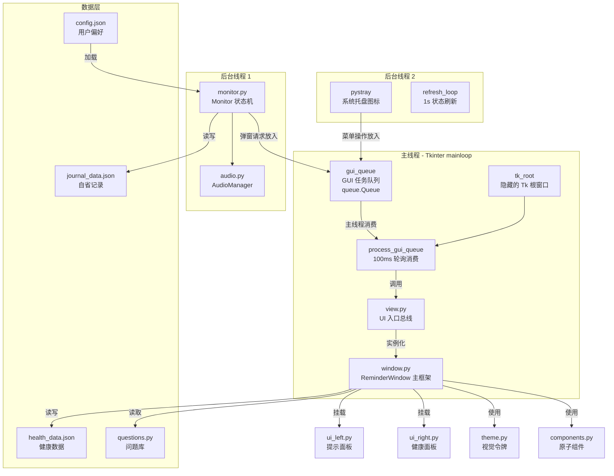

# 久坐健康助手 — 架构设计文档

> **项目名称**: Work Health (久坐健康助手)  
> **平台**: Windows 桌面端 (Python + Tkinter + pystray)  
> **最后更新**: 2026-04-18  

---

## 1. 项目概述

**久坐健康助手** 是一款 Windows 系统托盘常驻应用，核心功能是 **Pomodoro 式工作-休息计时器**，同时融合了 **每日生理健康指标追踪** 和 **Dan Koe "人生游戏"自省问答系统**。

### 1.1 核心价值主张

| 维度 | 功能 |
|------|------|
| 🧘 **身体健康** | 周期性强制休息提醒，防止久坐损伤 |
| 📊 **数据追踪** | 体重、血压、心率等生理指标的每日累计记录 |
| 💭 **心理自省** | 基于 Dan Koe "人生重启协议"的三阶段自省问答 |
| 🎮 **游戏化** | "人生游戏面板"将长期目标拆解为可操作的六组件系统 |

---

## 2. 系统架构总览



---

## 3. 核心组件 (Core Components)

- **`main.py`**: 应用程序入口，管理线程初始化与单例锁。
- **`monitor.py`**: 核心逻辑引擎，处理计时、状态切换与系统活动检测。
- **`view.py`**: UI 入口，协调窗口的显示与关闭。
- **`window.py`**: 提醒窗口主框架，协调各子面板与中心交互业务流。
- **`ui_left.py`**: 左侧"人生游戏"提示面板组件。
- **`ui_right.py`**: 右侧"生理指标"录入面板组件。
- **`theme.py`**: UI 视觉令牌（颜色、字体）。
- **`components.py`**: 可复用的 UI 基础组件。
- **`audio.py`**: 音频播放控制器。
- **`questions.py`**: 自省问题库与金句库。
- **`config_manager.py`**: 数据持久化处理。
- **`utils.py`**: Windows 专用工具函数。

---

## 4. 模块职责 (Module Responsibilities)

### 4.1 `main.py` (The Orchestrator)
- **线程管理**: 启动 Monitor 和 Tray 线程。
- **消息路由**: 监听 `gui_queue` 并根据消息类型调用 `view.py` 中的渲染函数，确保所有 GUI 操作均在主线程执行。

### 4.2 `monitor.py` (The Engine)
- **状态管理**: 维护 `WORK`, `PROMPT`, `BREAK`, `SNOOZE` 状态。
- **活动检测**: 自动感应用户离开（锁定或空闲）并暂停计时。

### 4.3 `window.py` & `view.py` (The Interface)
- **调度中心**: `view.py` 负责线程隔离；`window.py` 负责全屏窗口的实例化与三栏布局编排。
- **子面板协作**: `window.py` 在休息开始时实例化 `ui_left.py` 和 `ui_right.py`。
- **交互逻辑**: 中栏的问题展示与多行文本回答逻辑保留在 `window.py` 中。

---

## 5. 模块详解 (核心 UI 拆分版)

### 5.1 布局总线 — `window.py`
**职责**: 负责 Toplevel 窗口属性管理、背景遮罩、主计时器 (`after`)、中心区域 (Question/Answer) 状态切换以及最终数据的持久化拦截（调用 `ui_right` 获取输入值）。

### 5.2 左侧栏 — `ui_left.py` (Life Game Panel)
**职责**: 独立封装"人生游戏六组件"的展示逻辑。自动从 `questions.py` 获取最新回答，并处理 `placeholder` (灰色未填写态) 与随机金句展示。

### 5.3 右侧栏 — `ui_right.py` (Health Panel)
**职责**: 封装生理指标录入表单。内置 `placeholder` 刷新逻辑（自动查找历史记录）与 `dirty` 状态追踪。提供 `get_real_values()` 供主窗口在提交时调用。

### 5.4 视觉系统 — `theme.py` & `components.py`
**职责**: 定义项目的设计规范，提供 `_C` (Color)、`_F` (Font) 以及 `_CircleTimer` 等原子化组件。

---

## 6. 数据流 (Data Flow)

### 6.1 休息数据保存逻辑
1. 用户在 `ui_right.py` 表单中修改健康数值。
2. 用户在 `window.py` 的中栏完成思考后点击“提交”。
3. `window.py` 调用 `ui_right.get_real_values()` 提取数据。
4. `window.py` 整合两者数据并调用 `config_manager` 写入磁盘。
5. 向后台发送 `done_event`，唤醒 `monitor.py` 回到工作状态。

---

## 7. 文件结构

```
work_health/
├── src/                              # 源码目录
│   ├── main.py                       # 入口 · 编排 · 托盘
│   ├── monitor.py                    # 状态机 · 计时 · 活动检测
│   ├── view.py                       # UI 入口 · 生命周期
│   ├── window.py                     # 核心布局 · 三栏调度器
│   ├── ui_left.py                    # 子组件: 左侧提示面板
│   ├── ui_right.py                   # 子组件: 右侧健康面板
│   ├── theme.py                      # 视觉令牌 (颜色/字体)
│   ├── components.py                 # UI 基础组件 (CircleTimer/按钮)
│   ├── questions.py                  # 自省问题库 (33题 + 6组件 + 金句)
│   ├── config_manager.py             # JSON 读写 (config/health/journal)
│   ├── audio.py                      # pygame 音频管理
│   ├── utils.py                      # Windows 工具 (隐藏控制台/自启动)
│   ├── config.json                   # 用户偏好 [.gitignore]
│   ├── health_data.json              # 健康数据 [.gitignore]
│   ├── journal_data.json             # 自省记录 [.gitignore]
│   └── assets/
│       ├── icon.png                  # 托盘图标
│       ├── article.md                # 核心协议参考 (英)
│       ├── article_zh.md              # 核心协议参考 (中)
│       └── default_music.wav         # 默认提示音
```

---

## 8. 演进演进记录

- **v1.0**: 初始版本。
- **v1.1**: 模块化拆分。`view.py` 拆解为 `view`, `window`, `theme`, `components`。
- **v1.2**: 深度组件化。`window` 进一步剥离侧边栏逻辑至 `ui_left` 和 `ui_right`。
