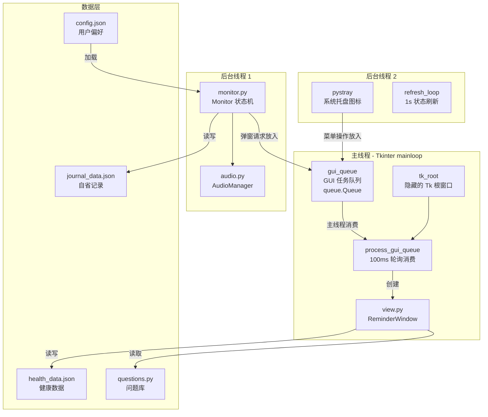
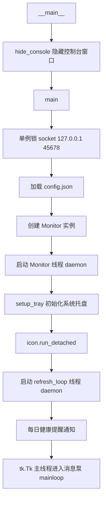
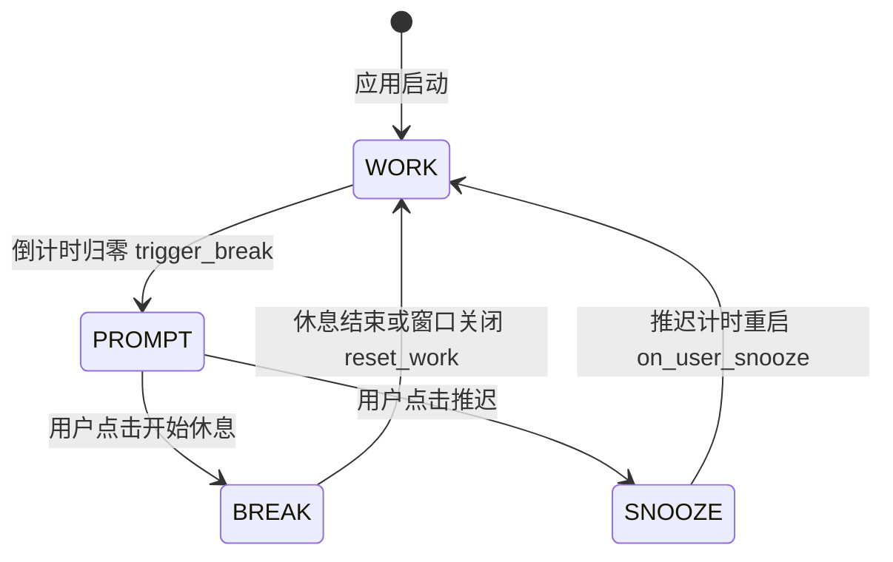
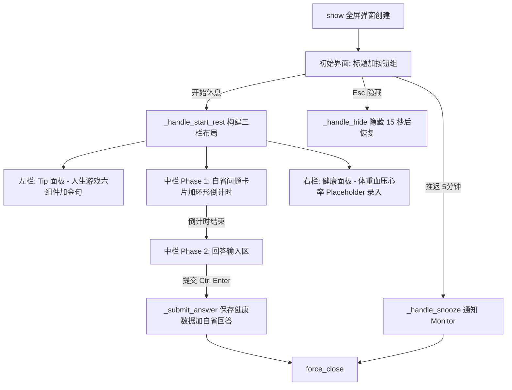
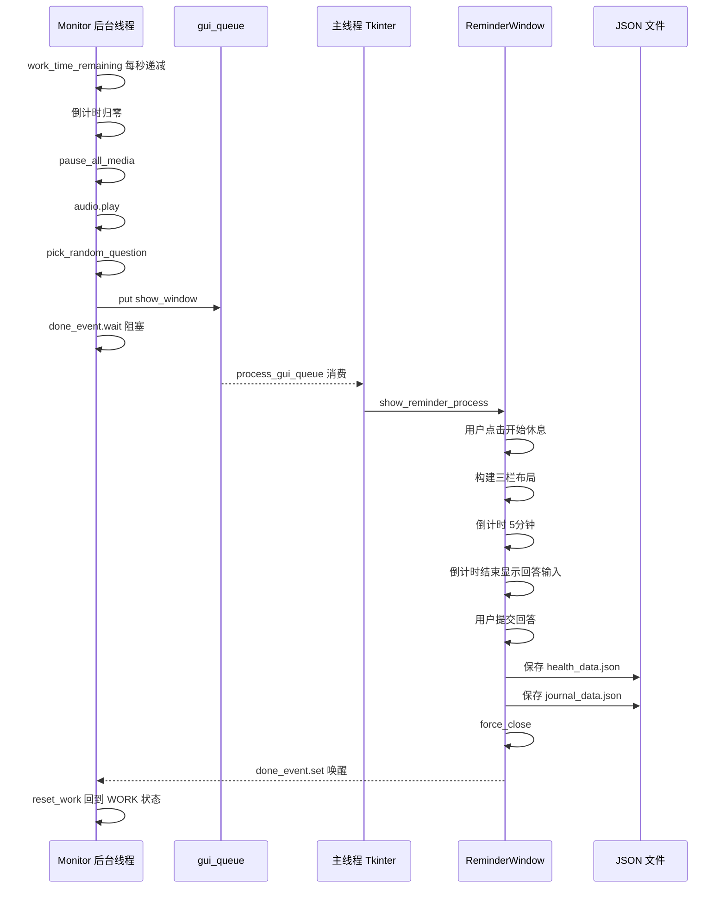

# 久坐健康助手 — 架构设计文档

> **项目名称**: Work Health (久坐健康助手)  
> **平台**: Windows 桌面端 (Python + Tkinter + pystray)  
> **最后更新**: 2026-04-18  

---

## 1. 项目概述

**久坐健康助手** 是一款 Windows 系统托盘常驻应用，核心功能是 **Pomodoro 式工作-休息计时器**，同时融合了 **每日生理健康指标追踪** 和 **Dan Koe "人生游戏"自省问答系统**。

### 1.1 核心价值主张

| 维度 | 功能 |
|------|------|
| 🧘 **身体健康** | 周期性强制休息提醒，防止久坐损伤 |
| 📊 **数据追踪** | 体重、血压、心率等生理指标的每日累计记录 |
| 💭 **心理自省** | 基于 Dan Koe "人生重启协议"的三阶段自省问答 |
| 🎮 **游戏化** | "人生游戏面板"将长期目标拆解为可操作的六组件系统 |

---

## 2. 系统架构总览



### 2.1 线程模型 — 三线程架构

| 线程 | 角色 | 关键组件 |
|------|------|----------|
| **主线程** | Tkinter 消息泵 + GUI 渲染 | `tk_root.mainloop()`, `process_gui_queue()` |
| **后台线程 1** | 工作计时 + 状态机驱动 | `Monitor.run()` |
| **后台线程 2** | 托盘图标 + 状态刷新 | `pystray.Icon.run_detached()`, `refresh_loop()` |

**关键设计决策**: 所有 GUI 操作必须在主线程执行。后台线程通过 `gui_queue` (线程安全队列) 将 GUI 任务投递到主线程消费，避免 Tkinter 跨线程崩溃。

---

## 3. 模块详解

### 3.1 入口模块 — `main.py` (291 行)

**职责**: 应用启动、组件编排、生命周期管理。



#### 关键函数

| 函数 | 作用 |
|------|------|
| `main()` | 编排启动流程：单例锁 → 配置加载 → Monitor 初始化 → 托盘启动 → 主循环 |
| `setup_tray()` | 构建系统托盘菜单（状态显示、健康记录、时长设置、音乐选择、自启动） |
| `process_gui_queue()` | 100ms 周期轮询 `gui_queue`，在主线程执行 GUI 任务 |
| `on_quit()` | 退出：停止托盘 → 停止 Monitor → 销毁 Tk 根窗口 |
| `select_music()` | 通过 `gui_queue` 在主线程打开文件选择对话框 |
| `set_duration()` | 通过 `gui_queue` 在主线程弹出时长设置对话框 |
| `record_health_data_threaded()` | 从托盘菜单触发手动健康数据录入 |
| `toggle_autostart()` | 切换开机自启（Windows 注册表） |

#### 单例锁机制

```python
# 通过绑定本地端口实现进程单例
lock_socket = socket.socket(socket.AF_INET, socket.SOCK_STREAM)
lock_socket.bind(("127.0.0.1", 45678))
# 如果端口已被占用 → 说明已有实例在运行 → 退出
```

---

### 3.2 核心状态机 — `monitor.py` (296 行)

**职责**: 工作-休息周期管理、用户活动检测、媒体控制。

#### 3.2.1 状态机



| 状态 | 含义 | 触发时机 |
|------|------|----------|
| `WORK` | 工作计时中 | 初始状态 / 休息结束 / 推迟后 |
| `PROMPT` | 提醒弹窗展示中 | 工作倒计时归零 |
| `BREAK` | 休息倒计时中 | 用户点击"开始休息" |
| `SNOOZE` | 推迟（瞬态） | 用户点击"推迟 5分钟"，立刻转为 WORK |

#### 3.2.2 活动检测 — 智能暂停

两个暂停条件（满足任一即暂停计时）:

1. **系统锁屏**: `GetForegroundWindow() == 0`
2. **空闲超过 20 分钟**: 通过 `GetLastInputInfo` 计算空闲时长

当用户离开电脑时自动暂停工作计时，回来后自动恢复。

#### 3.2.3 媒体控制

| 函数 | 行为 |
|------|------|
| `pause_all_media()` | 发送 `VK_MEDIA_STOP (0xB2)` 全局停止键 |
| `resume_all_media()` | **空操作** — 恢复由用户手动完成 |

> **设计理由**: 使用 STOP (0xB2) 而非 PLAY_PAUSE (0xB3)，避免"切换"行为将已暂停的播放器重新启动。

#### 3.2.4 核心方法

| 方法 | 职责 |
|------|------|
| `run()` | 主循环（后台线程），1s 周期检查活动状态 + 递减计时 |
| `trigger_break()` | 暂停媒体 → 播放提醒音乐 → 挑选自省问题 → 投递弹窗任务到 gui_queue |
| `_save_journal_answer()` | 保存自省问答回答到 `journal_data.json` |
| `on_user_start_rest()` | 状态切换 PROMPT → BREAK |
| `on_user_snooze()` | 停止音乐 → 重置计时为 snooze 时长 → 回到 WORK |
| `reset_work()` | 停止音乐 → 恢复媒体 → 累计完成轮次 → 重置计时 → 关闭所有弹窗 |

---

### 3.3 视图层 — `view.py` (842 行)

**职责**: 所有 GUI 界面的渲染与交互。

#### 3.3.1 设计系统 — Midnight Aurora 主题

```
_C (Color Tokens)                    _F (Font Tokens)
├── 背景层级（5级灰度）                  ├── HERO   (28pt bold)
│   BG_VOID → BG_BASE → BG_SURFACE   ├── H1-H3  (22/16/13pt)
│   → BG_OVERLAY → BG_HOVER           ├── BODY   (12/14pt)
├── 边框                               ├── EN_TITLE/BODY (英文字体)
│   BORDER / BORDER_GLOW               ├── TIMER  (Consolas 36pt)
├── 强调色                              └── BTN    (14pt bold)
│   AMBER / BLUE / CYAN / GREEN
│   RED / PURPLE + 各色渐变
└── 文字色
    FG / FG_DIM / FG_MUTED / FG_LINK
```

#### 3.3.2 UI 组件体系

| 组件 | 类型 | 描述 |
|------|------|------|
| `_hover()` | 辅助函数 | 给任意 widget 绑定鼠标 hover 颜色过渡 |
| `_make_button()` | 工厂函数 | 创建带 hover 效果的扁平按钮 |
| `_separator()` | 工厂函数 | 水平分隔线 |
| `_accent_bar()` | 工厂函数 | 装饰性强调色条 |
| `_CircleTimer` | 自定义组件 | Canvas 环形倒计时进度条，颜色随进度动态变化 |

#### 3.3.3 ReminderWindow — 主弹窗生命周期



#### 3.3.4 三栏布局详解

| 栏位 | 宽度 | 内容 |
|------|------|------|
| **左栏** (Tip 面板) | 330px 固定 | 人生游戏六组件 (s1-s6) 最新回答摘要；已填显示正常色，未填显示灰色 placeholder；底部随机金句 |
| **中栏** (问题/回答) | 弹性扩展 | Phase1: 中英双语问题卡片 + 环形倒计时；Phase2: 多行回答输入框 |
| **右栏** (健康面板) | 300px 固定 | 体重/收缩压/舒张压/心率输入框，带 placeholder 显示上次数据；仅在用户修改过时保存 |

#### 3.3.5 入口函数

| 函数 | 触发场景 | 行为 |
|------|----------|------|
| `show_reminder_process()` | Monitor 触发休息 | 创建完整提醒流程（按钮 → 三栏 → 倒计时 → 回答） |
| `show_manual_record()` | 托盘菜单"记录今日指标" | 跳过按钮和倒计时，直接进入三栏回答模式 |
| `close_active_window()` | Monitor 重置工作 | 强制关闭当前活动窗口 |

---

### 3.4 配置管理 — `config_manager.py` (66 行)

**职责**: 三类持久化 JSON 数据的读写。

| 数据文件 | 路径 | 内容 |
|----------|------|------|
| `config.json` | `src/config.json` | 用户偏好（音乐路径、工作时长） |
| `health_data.json` | `src/health_data.json` | 每日健康数据（按日期索引，支持当日多条记录累计） |
| `journal_data.json` | `src/journal_data.json` | 自省问答记录（按日期索引，含问题ID+中英文+回答+时间） |

#### 数据结构示例

```json
// health_data.json
{
  "2026-04-18": [
    {"weight": 70.5, "bp_high": "125", "bp_low": "82", "heart_rate": "72", "time": "14:30:00"},
    {"weight": 70.5, "bp_high": "120", "bp_low": "80", "heart_rate": "68", "time": "17:00:00"}
  ]
}
```

```json
// journal_data.json
{
  "2026-04-18": {
    "created_at": "09:00:00",
    "answers": [
      {
        "question_id": "d3",
        "question_en": "Am I moving toward...",
        "question_zh": "我正在走向...",
        "answer": "用户的回答内容",
        "answered_at": "14:35:00"
      }
    ]
  }
}
```

---

### 3.5 自省问答系统 — `questions.py` (445 行)

**职责**: 基于 Dan Koe "人生重启协议"的三阶段自省问题库 + 人生游戏六组件。

#### 3.5.1 问题分类

| 阶段 | 数量 | 自动激活时间 | 主题 |
|------|------|-------------|------|
| 早晨 (Morning) | 15 题 | 05:00 – 12:00 | 心理挖掘：觉察痛苦、反愿景、最小可行愿景 |
| 全天 (Daytime) | 11 题 | 12:00 – 20:00 | 打断自动驾驶：定时中断 + 补充反思 |
| 晚间 (Evening) | 7 题 | 20:00 – 05:00 | 综合洞察：反愿景压缩、目标透镜 |
| 综合 (Synthesis) | 6 组件 | 常驻左栏显示 | 人生游戏面板：反愿景/愿景/1年/1月/每日/规则 |

**总计**: 33 道自省问题 + 6 个人生游戏组件 + 6 条启发金句

#### 3.5.2 核心函数

| 函数 | 功能 |
|------|------|
| `get_phase_by_time(hour)` | 根据小时判断当前阶段 (morning/daytime/evening) |
| `pick_random_question(phase, exclude_ids)` | 随机挑选未展示过的问题；耗尽后自动重置 |
| `get_question_by_id(id)` | 按 ID 精确查找问题 |
| `get_latest_synthesis_answers()` | 从 journal_data 提取 s1-s6 的最新回答 |
| `pick_random_quote()` | 随机返回一条启发金句 |

---

### 3.6 音频管理 — `audio.py` (50 行)

**职责**: 提醒音乐的播放控制。

| 方法 | 功能 |
|------|------|
| `__init__()` | 初始化 `pygame.mixer` |
| `set_music(path)` | 设置自定义音乐路径 |
| `play(loops=-1)` | 播放音乐（默认无限循环） |
| `stop()` | 停止播放 |
| `set_volume(vol)` | 设置音量 (0.0-1.0) |

**依赖**: `pygame.mixer` — 跨平台音频后端。

---

### 3.7 工具模块 — `utils.py` (62 行)

**职责**: Windows 平台特定的系统工具。

| 函数 | 功能 | 机制 |
|------|------|------|
| `hide_console()` | 隐藏控制台窗口 | 检测 `python.exe` → 用 `pythonw.exe` 重启；或隐藏 console window |
| `is_autostart_enabled()` | 检查是否已启用开机自启 | 读取注册表 `HKCU\...\Run` |
| `set_autostart(enable)` | 设置/取消开机自启 | 写入/删除注册表键值 |

---

### 3.8 资源生成 — `generate_assets.py` (53 行)

**职责**: 首次运行前生成默认图标和提示音。

| 生成物 | 路径 | 内容 |
|--------|------|------|
| `icon.png` | `src/assets/icon.png` | 64x64 绿色圆形图标 (PIL 绘制) |
| `default_music.wav` | `src/assets/default_music.wav` | 1 秒正弦波提示音 (大三和弦琶音) |

---

## 4. 数据流

### 4.1 工作-休息周期



### 4.2 托盘菜单操作流程

```
用户右键托盘 → 点击菜单项
    → 回调函数将 GUI 操作包装为 lambda
    → 放入 gui_queue
    → 主线程 process_gui_queue() 消费执行
    → 弹出对应的 Toplevel 窗口 (文件选择/时长设置/健康录入)
```

---

## 5. 文件结构

```
work_health/
├── src/                              # 源码目录
│   ├── main.py                       # 入口 · 编排 · 托盘
│   ├── monitor.py                    # 状态机 · 计时 · 活动检测
│   ├── view.py                       # 全部 GUI (设计系统 + 弹窗)
│   ├── questions.py                  # 自省问题库 (33题 + 6组件 + 金句)
│   ├── config_manager.py             # JSON 读写 (config/health/journal)
│   ├── audio.py                      # pygame 音频管理
│   ├── utils.py                      # Windows 工具 (隐藏控制台/自启动)
│   ├── config.json                   # 用户偏好 [.gitignore]
│   ├── health_data.json              # 健康数据 [.gitignore]
│   ├── journal_data.json             # 自省记录 [.gitignore]
│   └── assets/
│       ├── icon.png                  # 托盘图标
│       └── default_music.wav         # 默认提示音
│
├── generate_assets.py                # 资源生成脚本
├── run_test_mode.bat                 # 测试模式启动 (1min 工作周期)
├── README.md                         # 用户文档
├── ARCHITECTURE.md                   # 本文档
└── .gitignore                        # 屏蔽敏感数据和临时文件
```

---

## 6. 依赖项

| 包 | 用途 |
|----|------|
| `pystray` | Windows 系统托盘图标 |
| `Pillow` | 图标加载 + 资源生成 |
| `pygame` | 音频播放 (mixer) |
| `tkinter` | GUI 框架 (Python 标准库) |
| `ctypes` | Win32 API 调用 (活动检测 / 媒体控制) |
| `winreg` | Windows 注册表操作 (开机自启) |

---

## 7. 关键设计决策记录

### 7.1 为什么用 `gui_queue` 而不是直接调用 GUI？

Tkinter **不是线程安全的**。所有 widget 操作必须在创建了 `Tk()` 的主线程中执行。后台线程（Monitor / pystray）通过 `queue.Queue` 将 GUI 任务投递，主线程 100ms 轮询消费，保证线程安全。

### 7.2 为什么用 `socket` 做单例锁？

比文件锁更可靠——进程崩溃后端口立即释放，不会留下遗留锁文件。绑定 `127.0.0.1:45678` 的 TCP socket 作为进程唯一性标识。

### 7.3 为什么 `SNOOZE` 是瞬态而非持久状态？

推迟操作的语义是"用推迟时长替换工作时长，立刻回到 WORK 状态"，因此 `on_user_snooze()` 在设置完 `work_time_remaining` 后立刻将 `state` 切换回 `WORK`。

### 7.4 为什么 `resume_all_media()` 是空操作？

避免自动恢复用户已手动暂停的媒体。"暂停是强制的，恢复是自由的"— 更符合用户心理预期。

### 7.5 健康数据为什么支持当日多条记录？

用户可能在不同休息周期记录不同时段的生理指标（如上午/下午血压对比）。使用数组存储，后续可计算日均值。

---

## 8. 已知约束与演进方向

### 8.1 当前约束

- **仅 Windows**: 依赖 `ctypes.windll`、`winreg`、`pystray` 的 Windows 后端
- **本地存储**: 数据文件存储在 `src/` 目录下，无云同步
- **单显示器**: 全屏弹窗假设单显示器环境
- **无数据可视化**: 健康数据仅做记录，缺少趋势图表

### 8.2 潜在演进方向

| 方向 | 说明 |
|------|------|
| 📈 数据可视化 | 为健康数据和自省频率添加趋势图表 |
| ☁️ 数据同步 | 支持 JSON 数据导出/导入或云备份 |
| 🔔 智能提醒 | 基于 `DAYTIME_QUESTIONS` 的 `time` 字段实现定时推送 |
| 🎨 主题定制 | 将 Midnight Aurora 的 `_C`/`_F` 令牌外部化为主题配置 |
| 📊 统计面板 | 每周/每月完成轮次、回答率、健康指标统计 |
