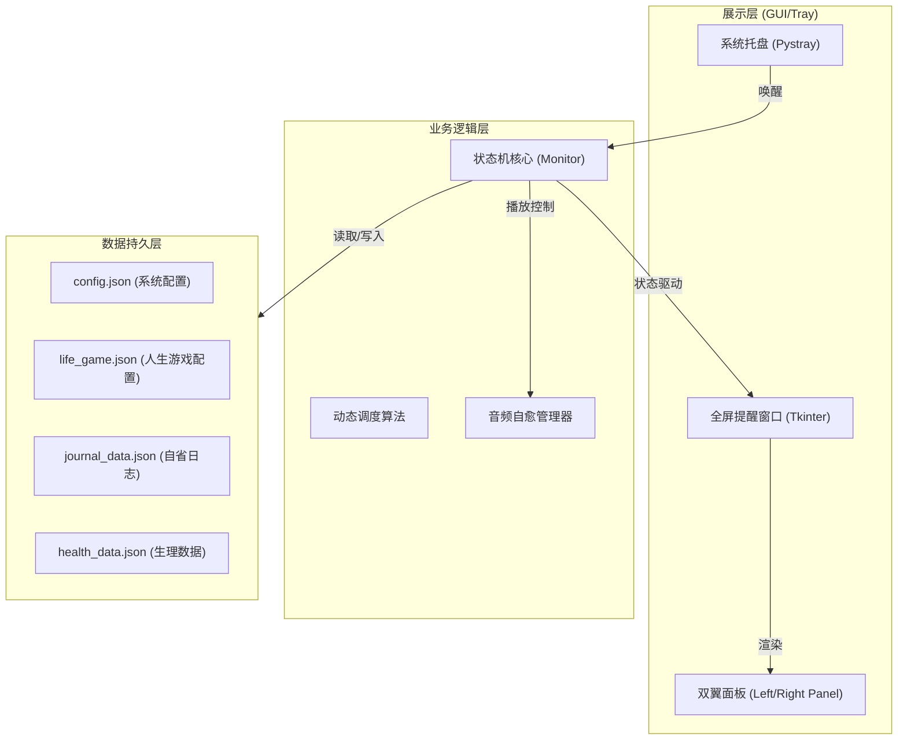
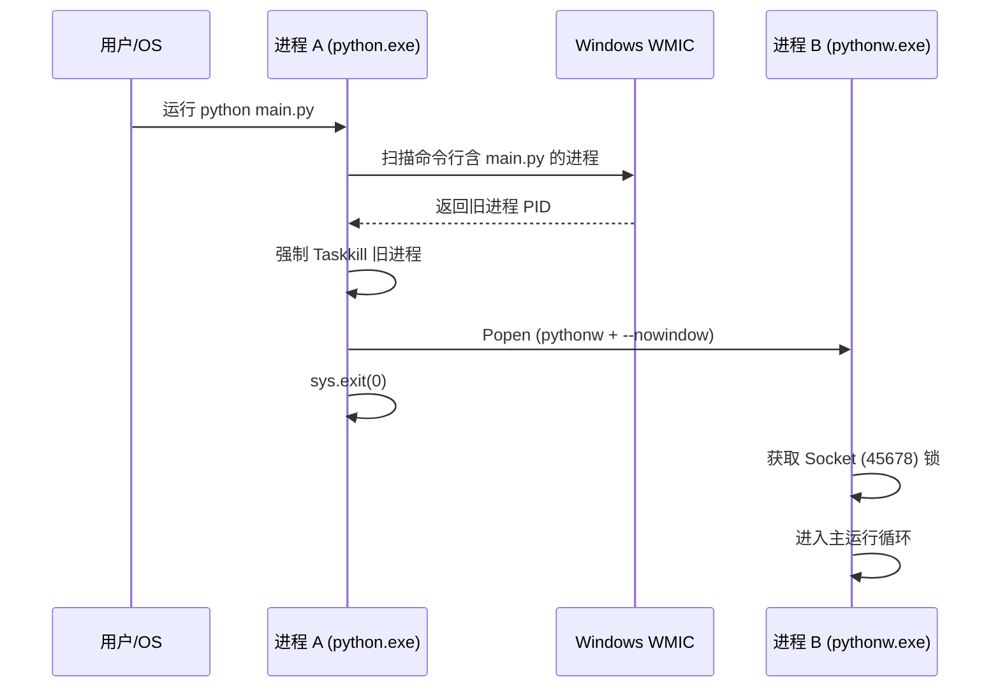

# Work Health 架构设计文档 (ARCHITECTURE.md)

## 1. 概述 (Overview)

| 维度 | 详细内容 |
| :--- | :--- |
| **项目名称** | Work Health (久坐健康助手) |
| **核心技术栈** | Python 3.x, Tkinter, Pygame (Audio), Pystray (Tray), JSON |
| **核心价值** | 🛡️ 保护开发者生理健康，通过“人生游戏”框架实现长期生产力与心理自省的平衡。 |
| **最后更新** | 2026-04-21 |

### 核心功能点
*   🎮 **人生游戏引擎**: 基于 Dan Koe 哲学，通过 `life_game.json` 配置 6 大核心组件（愿景/反愿景等）。
*   ⏳ **动态番茄钟**: 智能识别时段（如晨间冲刺），自动切换工作/休息时长策略。
*   🧠 **深度自省系统**: 提供分阶段（早/中/晚）的心理建设提问，支持 Markdown 格式日志持久化。
*   📊 **健康指标追踪**: 每日强制/手动录入体重、血压等核心指标并存档。

---

## 2. 系统架构设计 (System Architecture)



> **架构说明**：系统采用“监视器-拦截器”模型。`Monitor` 在后台线程维持状态机，当番茄钟耗尽时，通过 GUI 任务队列在主线程唤醒全屏 `ReminderWindow` 拦截用户操作。

---

## 3. 核心组件与模块职责 (Core Components & Responsibilities)

*   **Monitor (monitor.py)**
    *   **职责**：全局状态机管理 (WORK -> PROMPT -> BREAK -> SNOOZE)；管理 `gui_queue`；触发跨进程清理。
    *   **边界**：不直接操作 UI 组件，仅通过回调或队列下达指令。
*   **ReminderWindow (window.py)**
    *   **职责**：管理全屏沉浸式体验；编排左（人生游戏）、右（生理指标）、中（计时与问答）三个核心仓的布局。
    *   **关键接口**：通过 `on_answer` 回调将数据传回逻辑层。
*   **Audio Manager (audio.py)**
    *   **职责**：处理音频加载、路径自愈（将相对路径转换为绝对路径）、跨状态背景音切换。
*   **Config Manager (config_manager.py)**
    *   **职责**：统一负责全系统 4 个 JSON 文件的 I/O。

---

## 4. 核心业务数据流 (Data Flow)

### 场景：抢占式单例启动与控制台隐藏



1.  **进程 A** 启动并立即收割旧实例。
2.  通过 **WMIC** 扫描确保系统干净。
3.  启动 **进程 B** 并携带 `--nowindow` 参数以避开控制台。
4.  **进程 B** 锁定 Socket 确保单例，正式接管托盘。

---

## 5. 数据与存储架构 (Data & Storage Architecture)

*   **life_game.json**: 存储人生游戏的长期使命。用户手动编辑，程序只读并在 UI 展示。
*   **journal_data.json**: 按日期索引存储自省回答。新数据追加在 `answers` 数组中。
*   **health_data.json**: 按日期存储生理指标快照。支持同一天多次录入。
*   **持久化策略**：使用 Python 原生 `json` 模块，配置 `ensure_ascii=False` 保证中文字符集原生呈现。

---

## 6. 非功能性设计 (Non-Functional Requirements)

*   **可靠性 (Reliability)**：
    *   **路径自愈**：启动时自动扫描音频文件是否存在，若配置失效则基于 `root` 目录进行搜索重定向。
    *   **端口抢占**：通过强制杀掉端口占用者，确保应用永远能够更新重启，不会死锁在后台。
*   **性能优化 (Performance)**：
    - **非阻塞 I/O**：日志写入和音频播放均在独立线程或异步方式处理，不影响 UI 刷新。
    - **资源懒加载**：大文件（如自省记录）仅在保存或特定查询时加载。

---

## 7. 物理结构与目录树 (Directory Structure)

```tree
work_health/
├── src/
│   ├── assets/             # 静态资源（图标、音频、问答库）
│   ├── config_manager.py   # JSON I/O 核心
│   ├── monitor.py          # 状态机与后台逻辑
│   ├── questions.py        # 问答库与检索算法
│   ├── theme.py            # 统一 UI 令牌 (Tokens)
│   ├── ui_left.py          # 人生游戏展示面板
│   ├── ui_right.py         # 健康指标录入面板
│   ├── utils.py            # UAC 绕过/进程清理/自启工具
│   ├── view.py             # 窗口总线
│   └── window.py           # 全屏提醒核心组件
├── config.json             # 系统运行时配置
├── life_game.json          # 人生游戏 6 组件 (用户编辑)
├── app.log                 # 运行日志 (UTF-8)
└── main.py                 # 启动入口 (进程管理器)
```

---

## 8. 演进路线图 (Roadmap)

*   **v1.0 (MVP)**: 基础计时与弹窗。
*   **v1.x (Current)**: 引入人生游戏框架、抢占式启动流、动态番茄钟策略。
*   **v2.0 (Planned)**: 
    - 引入可视化图表（体重/血压/专注度趋势）。
    - 增加基于人生游戏的进度条视觉系统。
    - 支持 Obsidian 同步插件直读 journal 数据。
